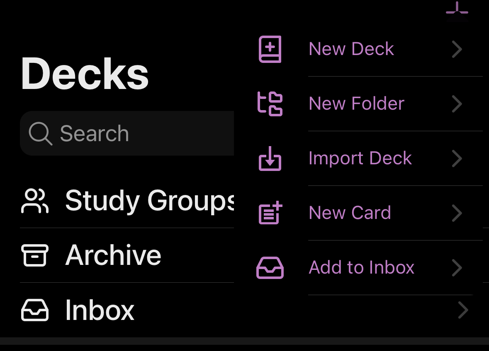
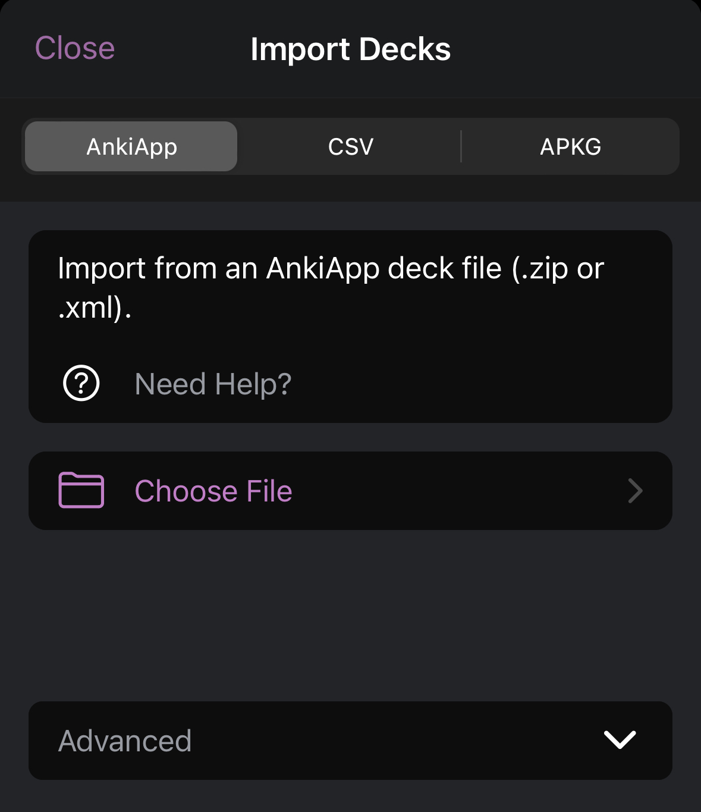
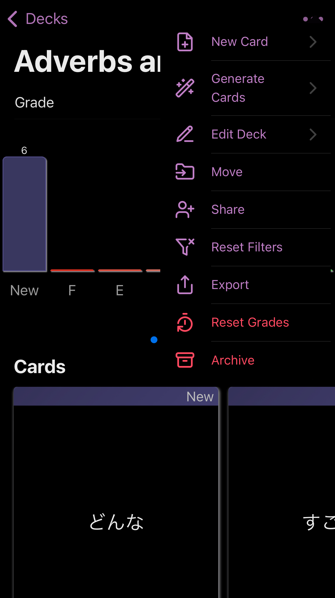

# Resources for Japanese Study
Given I seem to spend more time looking up resources to study Japanese than I actually do studying them, I thought I would put down my favourite resources I have found so that others might be able to use these.

## Join a Japanese Class
There is no better option than attending classes at a Japanese school (preferably in person). Find a school that uses the [Genki](https://genki3.japantimes.co.jp/en/) textbooks and course. A lot of the resources below are to help with studying the Genki content.

## General Genki Study
- [Genki Self-study Room](https://genki3.japantimes.co.jp/en/student/) 
  - Self-study Room offers a variety of online materials to support your learning with GENKI textbooks.
  - There are also questions in the Genki book at the back for each chapter.
- [Genki Exercises](https://sethclydesdale.github.io/genki-study-resources/lessons-3rd/) 
  - A website for the textbook exercises that you can do online (or offline if you download the repo from github).

### Videos
- [ToKini Andy's Playlist](https://www.youtube.com/playlist?list=PLA_RcUI8km1NMhiEebcbqdlcHv_2ngbO2)
  - JLPT N5 Lessons based on the Genki Textbooks with 100% original examples
- [Japanese With Shun's Playlist](https://www.youtube.com/playlist?list=PLUqu4MKiV5q_0_8JRUXVIJ-yuX1RNYJlF)
  - Japanese Podcasts for Genki lessons

## Hiragana / Katakana
- [Learn Hiragana: The Ultimate Guide](https://www.tofugu.com/japanese/learn-hiragana/) 
  - Tofugu's full guide - includes heaps of additional resources and using mnemonics for memorisation.
- [Learn Katakana: The Ultimate Guide](https://www.tofugu.com/japanese/learn-katakana/) 
  - Tofugu's guide for katakana (similar to above).
- [Kana app](https://apps.apple.com/au/app/kana-hiragana-and-katakana/id1454200955) (iOS only) 
  - Practice drawing, reading, writing and speaking Japanese Hiragana and Katakana.

## Vocab
- [Anki](https://apps.ankiweb.net/) 
  - Flashcards using techniques from cognitive science such as active recall testing and spaced repetition to aid the user in memorization
  - Flashcard data for vocab from the Genki textbooks can be found in the [anki-flashcards](./anki-flashcards/) folder (as much as I have made, anyway). See [below](#how-to-import-flashcards-in-the-anki-app) for importing it into your app.

## Kanji
- [WaniKani](https://www.wanikani.com/) 
  - "Japanese radicals, kanji, and vocabulary learning web app that uses mnemonics and SRS to make kanji learning simple." 👌🏻

## Other Resources
- [Duolingo](https://www.duolingo.com/) 
  - You've probably heard of it. It may be a slightly controversial choice, but there is no denying that 500 days of Duolingo Japanese really helped improve my vocab, and my pronounciation, not to mention it is very pretty. Just be aware that you are absolutely not going to learn to speak Japanese with just this option.
- [Pimsleur Japanese](https://www.pimsleur.com/learn-japanese/) 
  - A slightly different type of learning developed by a professor of applied linguistics, this course uses the [Pimsleur method](https://en.wikipedia.org/wiki/Pimsleur_Language_Programs).
  - This is an audio-based course that has you repeating words and phrases out loud in a way that helps with learning and retention. You may have seen characters in older TV shows or movies learning a new language by listening to tapes - that it Pimsleur! While you won't learn Japanese in it's entirety, it may be a good option to achieve a basic level of proficiency suitable for for travel or business.

-----

## How to import flashcards in the Anki App
1. From the main page, click the + menu and "Import Deck"

1. Click on "Choose File"

1. Select the xml file from this repository that you have downloaed on your device
1. You will immediately find yourself in the deck, which is imported in a random location. Click on the three dots and move it to your desired location
