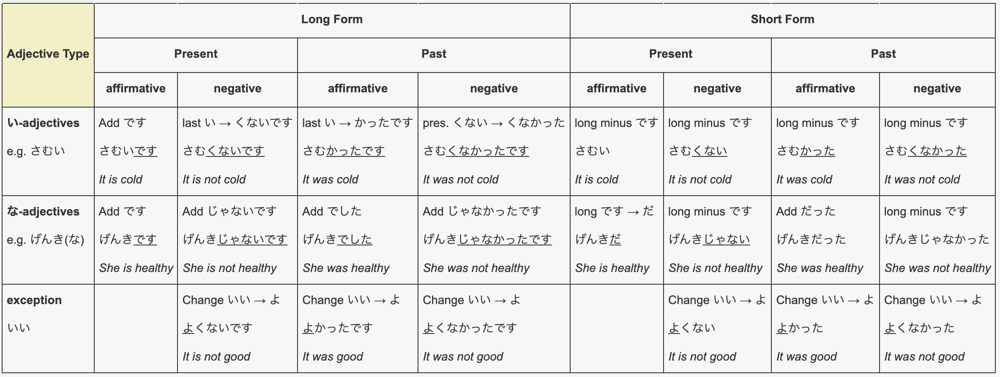

# Adjective Conjugation Chart

<link rel="stylesheet" type="text/css" href="./style.css" />
<table class="tg"><thead>
  <tr>
    <th class="tg-g7sd" rowspan="3">Adjective Type</th>
    <th class="tg-7btt" colspan="4">Long Form</th>
    <th class="tg-7btt" colspan="4">Short Form</th>
  </tr>
  <tr>
    <th class="tg-7btt" colspan="2">Present</th>
    <th class="tg-7btt" colspan="2">Past</th>
    <th class="tg-7btt" colspan="2">Present</th>
    <th class="tg-7btt" colspan="2">Past</th>
  </tr>
  <tr>
    <th class="tg-7btt">affirmative</th>
    <th class="tg-7btt">negative</th>
    <th class="tg-7btt">affirmative</th>
    <th class="tg-7btt">negative</th>
    <th class="tg-7btt">affirmative</th>
    <th class="tg-7btt">negative</th>
    <th class="tg-7btt">affirmative</th>
    <th class="tg-7btt">negative</th>
  </tr></thead>
<tbody>
  <tr>
    <td class="tg-0pky">い-adjectives  e.g. さむい</td>
    <td class="tg-0pky">Add です  さむいです  It is cold</td>
    <td class="tg-0pky">last い → くないです  さむくないです  It is not cold</td>
    <td class="tg-0pky">last い → かったです  さむかったです  It was cold</td>
    <td class="tg-0pky">pres. くない → くなかった  さむくなかったです  It was not cold</td>
    <td class="tg-0pky">long minus です  さむい  It is cold</td>
    <td class="tg-0pky">long minus です  さむくない  It is not cold</td>
    <td class="tg-0pky">long minus です  さむかった  It was cold</td>
    <td class="tg-0pky">long minus です  さむくなかった  It was not cold</td>
  </tr>
  <tr>
    <td class="tg-0pky">な-adjectives  e.g. げんき(な)</td>
    <td class="tg-0pky">Add です  げんきです  She is healthy</td>
    <td class="tg-0pky">Add じゃないです  げんきじゃないです  She is not healthy</td>
    <td class="tg-0pky">Add でした  げんきでした  She was healthy</td>
    <td class="tg-0pky">Add じゃなかったです  げんきじゃなかったです  She was not healthy</td>
    <td class="tg-0pky">long です → だ  げんきだ  She is healthy</td>
    <td class="tg-0pky">long minus です  げんきじゃない  She is not healthy</td>
    <td class="tg-0pky">Add だった  げんきだった  She was healthy</td>
    <td class="tg-0pky">long minus です  げんきじゃなかった  She was not healthy</td>
  </tr>
  <tr>
    <td class="tg-0pky">exception  いい</td>
    <td class="tg-0pky"></td>
    <td class="tg-0pky">Change いい → よ  よくないです  It is not good</td>
    <td class="tg-0pky">Change いい → よ  よかったです  It was good</td>
    <td class="tg-0pky">Change いい → よ  よくなかったです  It was not good</td>
    <td class="tg-0pky"></td>
    <td class="tg-0pky">Change いい → よ  よくない  It is not good</td>
    <td class="tg-0pky">Change いい → よ  よかった  It was good</td>
    <td class="tg-0pky">Change いい → よ  よくなかった  It was not good</td>
  </tr>
</tbody></table>